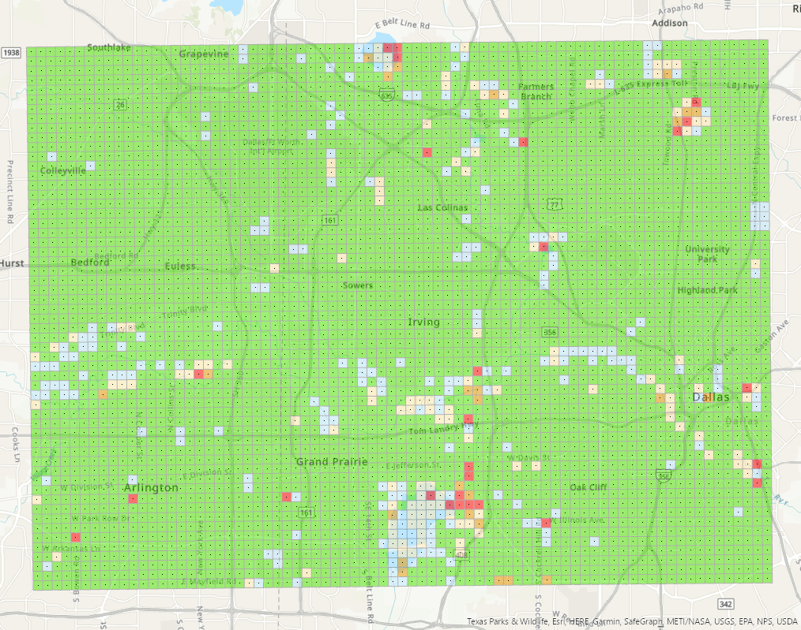

# Signal Strength Grouping by Operating Class

Processes wireless channel-availability data, averaging signal strength by location and
operating class, then grids and visualises the result as an interactive heat map.

The dataset covers a region south of Dallas, Texas.



## Background

Channel availability data arrives as one row per channel measurement — many readings at
the same coordinates across different channel indices and operating classes. Mapping it
raw is useless: thousands of overlapping points at identical locations.

These scripts reduce it to one averaged value per location per operating class, then
aggregate onto a regular grid so the spatial pattern becomes visible.

## Scripts

| Script | Purpose |
|--------|---------|
| [`grouping.py`](grouping.py) | Averages `MaxEirp` by location for each of the five operating classes |
| [`gridding.py`](gridding.py) | Builds a 77-cell grid over operating class 134 and joins points into cells |
| [`Webmap.py`](Webmap.py) | Renders the result as an interactive heat map |

Run them in that order — `gridding.py` and `Webmap.py` both consume output from
`grouping.py`.

### grouping.py

Loops over operating classes `131`, `132`, `133`, `134` and `136`. For each one it builds
a combined `Lat/Long` key and groups on it, rather than grouping on latitude or longitude
alone — a single latitude value recurs at many different longitudes, so grouping on either
axis by itself would merge unrelated locations.

Writes `Data/points{class}.csv` per class and prints total processing time.

### gridding.py

Takes operating class 134, computes the bounding box of the averaged points, and divides
it into 77 cells across. Each grid cell is built as a Shapely `box`, and points are joined
into cells with a spatial `contains` predicate.

Writes `Data/join1.geojson`.

### Webmap.py

Renders the gridded output as a Leafmap heat map weighted by `MaxEirp`, and writes a
standalone `Data/index.html`.

## Requirements

```bash
pip install -r requirements.txt
```

- Python 3.8+
- `geopandas`, `numpy`, `leafmap`, `folium`

## Usage

```bash
python grouping.py     # average by location, per operating class
python gridding.py     # grid operating class 134
python Webmap.py       # render the heat map
```

## Base map configuration

`Webmap.py` uses OpenStreetMap tiles by default, which require no credentials.

To use the Mapbox style instead, set a token in your environment:

```bash
export MAPBOX_TOKEN=pk.your_token_here    # Windows: set MAPBOX_TOKEN=...
python Webmap.py
```

## Repository layout

```
├── grouping.py       # averaging by location
├── gridding.py       # grid construction and spatial join
├── Webmap.py         # heat map rendering
├── Data/             # input CSVs, intermediate outputs, generated map
└── screenshots/      # map previews
```

## Notes

The grid resolution in `gridding.py` is set by `n_cells = 77`, chosen to approximate the
measurement spacing of the source data. Raising it produces a finer grid with more empty
cells; lowering it smooths over real variation.
